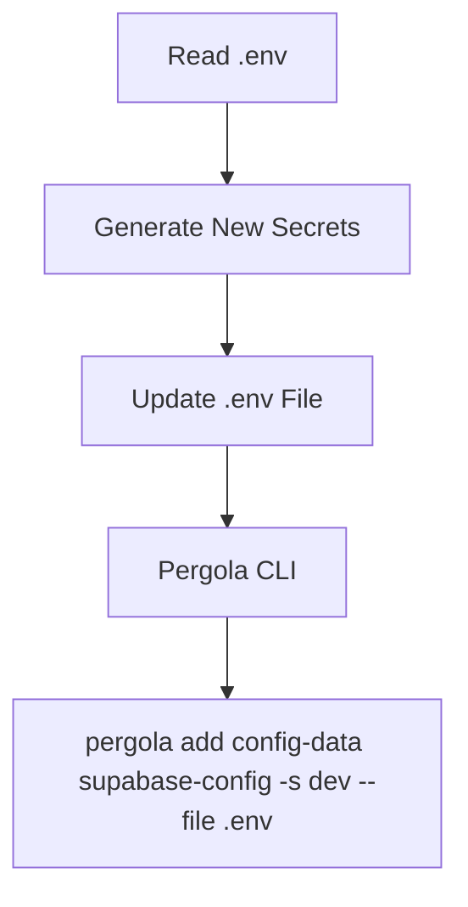

# Pergola Configuration Plan

This plan outlines the steps to rotate secrets in `.env` and apply them to the Pergola environment using the CLI.

## Workflow

1.  **Secret Generation**:
    *   For each secret key in `.env`, generate a new secure value using `openssl rand -hex 12` (or equivalent).
    *   Special handling for Supabase keys (ANON_KEY, SERVICE_ROLE_KEY) if they need specific formats, otherwise default to secure random strings as requested.

2.  **Pergola CLI Integration**:
    *   The `pergola.yaml` file defines `config-ref` for several environment variables.
    *   We will use `pergola config set <key>=<value>` or `pergola secret set <key>=<value>` based on the CLI documentation requirements.

## Implementation Steps

### 1. Update `.env` with Random Values
A script will iterate through the keys in the "Secrets" section of `.env` and replace their values with fresh random ones.

### 2. Apply to Pergola
The CLI command `pergola add config-data supabase-config -s dev --file .env` will be used to apply the configuration.

## Config Keys identified in `pergola.yaml`:
- `ANON_KEY`
- `SERVICE_ROLE_KEY`
- `JWT_SECRET`
- `PG_META_CRYPTO_KEY`
- `POSTGRES_PASSWORD`

(And others present in `.env` like `VAULT_ENC_KEY`, `DB_ENC_KEY`, etc. which might be used by other components or should be stored as secrets anyway).
